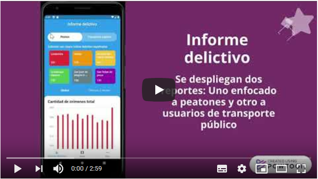

# Crimezone app

Aplicación móvil para Android con la funcionalidad para mostrar el índice delictivo de la alcaldía Gustavo A. Madero. Cuenta con las siguientes funciones:
* Encontrar el índice delictivo de la ubicación actual.
* Buscar el índice delictivo de una zona de manera manual.
* Informe delictivo por categoría.
    * Último mes.
    * Últimos 3 años.

